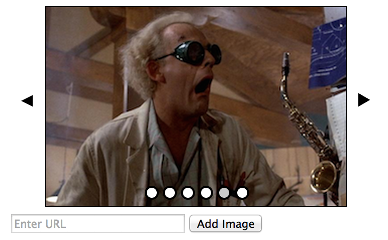

Carousel Example
================

This is a small example React application using Fluxxor.

To run, simply open `app/index.html` in your web browser—`index.html`, `bundle.js`, and the `images/` directory are the only files required to run the application (`bundle.js` is build with [Webpack](http://webpack.github.io/)). If you want to modify the source and see your updates, run `./start.sh` and point your browser to `http://localhost:8089/index.html` (you will need to install the `devDependencies` from the root of the Fluxxor project first).

Alternatively, check out the running example [on the Fluxxor website](http://fluxxor.com/examples/carousel/).

The entry point of the application is `app/app.jsx`. The `Fluxxor.Flux` instance is exported to `window.flux` so that you can manipulate the application from the standard JavaScript console (e.g. the methods on `window.flux.actions`).

Stores
------

The system contains two stores:

* `ImageStore` - Contains the list of images to display in the carousel
* `CarouselStore` - Contains information about the carousel position (which image is being displayed, etc.) and ensures that the user cannot change images while a transition is in progress

This separation is perhaps a bit contrived, but shows how you might use multiple stores in a Flux-based React application.

Actions
-------

There are four actions that manipulate the stores:

* `prevImage` - Moves the carousel to the previous image (modifies `CarouselStore`)
* `nextImage` - Moves the carousel to the next image (modifies `CarouselStore`)
* `selectImage` - Moves the carousel to a specific image (modifies `CarouselStore`)
* `addImage` - Adds an image to the carousel and moves to that image (modifies `ImageStore` and `CarouselStore`)

`addImage` is particularly interesting because the action handler inside `CarouselStore` utilizes the `waitFor` mechanism to allow the `ImageStore` to accept or reject adding the image (based on its file extension and whether the image is already in the carousel).

Components
----------

* `Application` - The top-level component that maintains state from the stores using `Fluxxor.StoreWatchMixin`
* `Carousel` - The actual image carousel itself; all data is passed as props, and user interaction is propagated back to `Application`
* `ImageForm` - A small form for adding images to the carousel; user interaction is propagated back to `Application`

Note that `ImageForm` has state outside of the data from the stores—however, it's localized to the form, and isn't part of the larger "application state." When the form is submitted, this local state is sent to the parent component through a property, where it is then sent to the dispatcher via the `addImage` action.

---

In this small application, only the top level `Application` component requires access to the Flux data. However, since `Application` mixes in `Fluxxor.FluxMixin`, any descendants of `Application` with the `Fluxxor.FluxChildMixin` would automatically have access to the `Fluxxor.Flux` instance via `this.getFlux()`.
